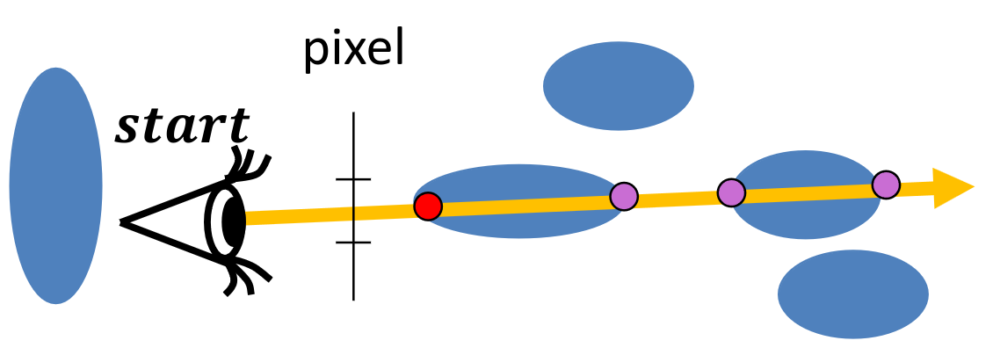
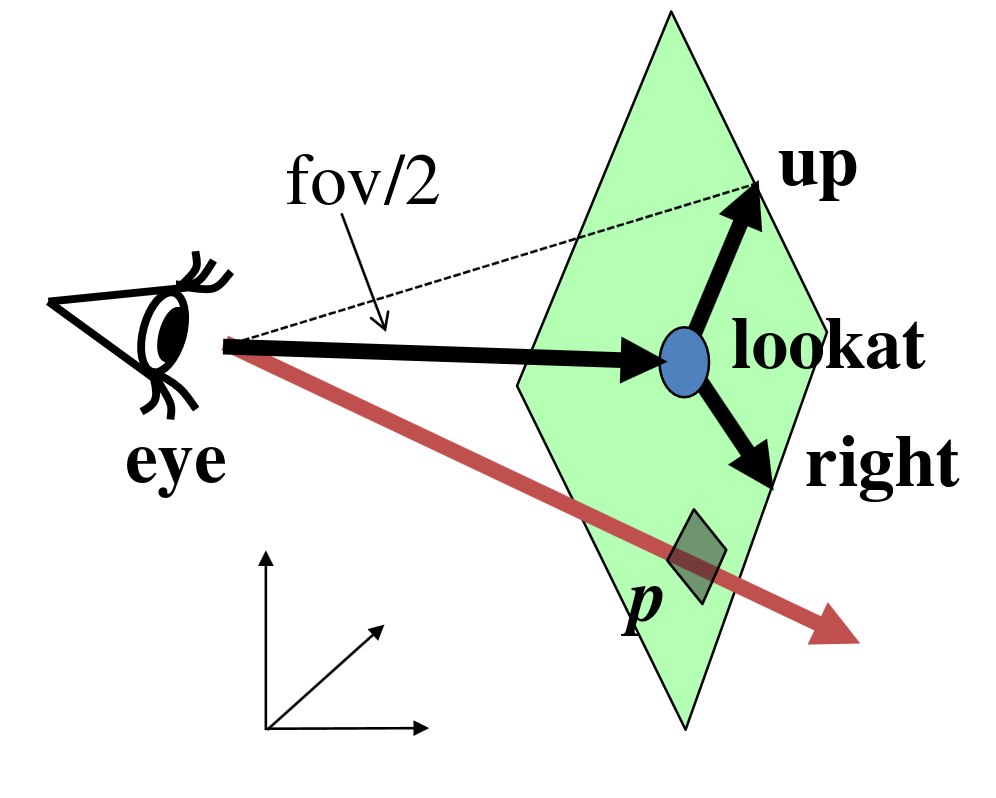

<!-- merengtél már egy olyan világon, ahol minden pontosan olyan, mint a milyénkben, azt leszámítva, hogy nem létezel? -->

# Sugárkövetés

> A dolog lényege, hogy egy 3D világ illúziójának képét szeretnénk a képernyőnkök látni, ezért kiszámoljuk, hogy bizonyos pixelekre a fény milyen úton jut el.

## Lokális illumináció
Csak absztrakt fényforrásokatat veszünk figyelembe, azokat is csak ha direkt módon világítják meg a testeket.


$L(V) \approx \sum_l {L^\text{in}}_l \cdot f_r(L_l, N, V) \cdot \cos^+ {\theta^\text{in}}_l 
\\
\qquad~~ = \sum_l {L^\text{in}}_l \cdot \{ k_d \cdot (L_l \cdot N)^+ + k_s \cdot \big((H_l \cdot N)^+\big)^\text{shine} \}$

## Ambiens tag
> Lokális illuminációnál azok a helyek, amiket semmilyen fény nem világít meg direktben, teljesen feketék lesznek. A való életben ez nem így van (golbális illumináció). Ennek egy olcsó megoldása, hogy mindent kivilágosítunk egy kicsit. Ez az ambiens fény.

Az ambiens tagot minden visszakövetett sugárhoz hozzáadjuk (csak egyszer!).

$L(V) \approx \sum_l {L^\text{in}}_l \cdot f_r(L_l, N, V) \cdot \cos^+ {\theta^\text{in}}_l + \boxed{k_a \cdot L_a}$

## Láthatóság
Adott pixelből elindítjuk a sugarat, meg kell keresnünk a legközelebbi objektumot, amibe a sugarunk beleütközik.


```cpp
Hit firstIntersect(Ray ray) {
    Hit bestHit;
    for(Intersectable * obj : objects) {
        Hit hit = obj->intersect(ray); // hit.t < 0 ha nincs metszés
        if(hit.t > 0 && (bestHit.t < 0 || hit.t < bestHit.t))
            bestHit = hit;
    }
    if (dot(ray.dir, bestHit.normal) > 0) 
        bestHit.normal *= -1; // mindenképpen felénk nézzen a normális
    return bestHit;
}
```

## Metszéspontszámítás
### Gömb


- Felület pontjai azon $r$ pontok, ahol $|r-c|^2 = R^2$
- Metszéspont:
Kiszámoljuk a másodfokú egyenletet, ahol $t$ az ismeretlen.
Ha két gyökünk van, a közelebbit tekintjük.
$|\text{ray}(t) - c|^2 = R^2 \\ \text{Megoldás: . . .}$
- Normálvektor: $N = (\text{ray}(t)-c)/R$


### Implicit felületek
- A felület pontjai azon $r$ pontok, ahol $f(r) = 0$
- Sugár: $\text{ray}(t) = s + d \cdot t$
- Legyen $t^*$ azon paraméter, ahol $\text{ray}(t^*) = r^*$ pontban a sugár metszi a felületet, azaz $f(r^*) = 0$
- Tehát a metszéspont: $r^*$
- Normálvektor: $N = \text{grad}f(r^*)$

### Kvadratikus felületek:
- A felület pontjai: $f(r) = \begin{bmatrix} r & 1 \end{bmatrix} \cdot Q \cdot \begin{bmatrix}r \\ 1\end{bmatrix} = 0$ 
*(Q szimmetrikus)*
- Metszésparaméter és metszéspont: $t^*$ és $r^*$ hasonlóképpen.
- Normálvektor: $N = \text{grad}f(r^*) = Q \cdot \begin{bmatrix} r^* \\ 1 \end{bmatrix}$ *első három koordinátája*


### Háromszögek, poligonok


- Pontjai:

    > Először megkeressük, hogy a háromszög síkját hol metszi, majd ellenőrizzük, hogy az adott pont benne van-e a háromszögben.

    1. Síkmetszés: 

        $(\text{ray}(t) - r1) \cdot n = 0 \qquad (t>0)$

        $$\boxed{t = \cfrac{(r1 - \text{start}) \cdot n}{\text{dir} \cdot n}}$$
    
    2. Belül van-e:

        $((r2  r1) \times (\bold{p}  r1)) \cdot n > 0$

        $((r3  r2) \times (\bold{p}  r2)) \cdot n > 0$

        $((r1  r3) \times (\bold{p}  r3)) \cdot n > 0$

- Normálvektor: $n$ *(vagy shaderrel állítjuk)*

## Render
<!-- igen csak azért is pájton -->
```py
for p in pixels:
    ray = getray(eye, pixel)
    color = trace(ray)
    write_pixel(p, color)
```

### `getray`

<!-- i will cry about it -->
```js
p = lookat + a * right + b * up // a, b in [-1, 1] (normalizált eszköz koordináták)
// ray:
start = eye
dir = p - eye 
```

## Rekurzív sugárkövetés


> Eddig csak a direkt megvilágítást vizsgáltuk, most belevesszük a tükröződést, fénytörést is.

$L(V) = \begin{cases} 
k_a \cdot L_a + \sum_l {L^\text{in}}_l \cdot \{ k_d \cdot (L_l \cdot N)^+ + k_s \cdot \big((H_l \cdot N)^+\big)^\text{shine} \} \\
% yeah
\underbrace{F(V \cdot N)}_{\text{Fresnel}} \cdot \underbrace{L^\text{in}(R)}_{\text{Tükör irányból érkező fény}} + \underbrace{\big(1 - F(V \cdot N)\big)}_{\text{1 - Fresnel}} \cdot \underbrace{L^\text{in}(T)}_{\text{Törési irányból érkező fény}}
\end{cases}$


# Kvíz

> 1\. Az $f(r)=[r, 1] \cdot Q \cdot [r, 1]^T=0$ implicit egyenletű kvadratikus felület és a $ray(t)=s + d \cdot t$ egyenletű sugár metszéspontjához a következő másodfokú egyenletet kell megoldani: $at^2+bt+c=0$.
Mi lesz a $b$?

*Megoldás:*
Széttrancsírozzuk...

$
0 = f(r) = [r, 1] \cdot Q \cdot [r, 1]^T \newline
0 = [s + d \cdot t, 1] \cdot Q \cdot [s + d \cdot t, 1]^T \newline
0 = ([s, 1] + t[d, 0]) \cdot Q \cdot ([s, 1] + t[d, 0])^T \newline
0 = [s,1]Q[s,1]^T + t([s,1]Q[d,0]^T) + t([d,0]Q[s,1]^T) + t^2([d,0]Q[d,0]^T)
$

Ahol 

$b = [s,1]Q[d,0]^T + [d,0]Q[s,1]^T$

És mivel $Q$ szimmetrikus *(nagyon remélem hogy ezért mert tényleg nem értem hogy másképp jön ki xdd)*

$b = 2[s,1]Q[d,0]^T = 2[d,0]Q[s,1]^T$


---
> 2\. Egy kvadratikus felület mátrixa az alábbi:
0, 0, 0, 1
0, 0, 0, 1
0, 0, 0, 1
1, 1, 1, -2
A felületet sugárkövetéssel jelenítjük meg, a szem az origóban van, a sugár irányvektora az (1, 1, 1).
Mennyi a kvadratikus felület normálvektorában az x és z komponensek aránya (n.x/n.z) ott, ahol a sugár először metszi a kvadratikus felületet.

*Megoldás (habár triviális):*
A sugár: $\text{ray}(t) = s + d \cdot t = (0, 0, 0) + (1, 1, 1) \cdot t = (t, t, t)$

A metszéspont:
$
0 = (t, t, t, 1) 
\begin{pmatrix} 
    0 & 0 & 0 & 1 \\
    0 & 0 & 0 & 1 \\
    0 & 0 & 0 & 1 \\
    1 & 1 & 1 & -2 \\
\end{pmatrix}
(t, t, t, 1)^T
\\
...\\
0 = 6t - 2\\
t = 1/3\\
r^* = (\frac 1 3,\frac 1 3,\frac 1 3)
$

Innen a normálvektor csak hab a tortán:
$N = \text{grad}f(r^*) = Q[r^*, 1]^T = (1, 1, 1, -1)$
Tehát az arányuk bosszantóan de kereken $1$.

---
> 3\. A sugár kezdőpontja (0, 0, 0), irányvektora (2,0,0). Hol metszi ez a sugár a (8,0,0) középpontú, 8 sugarú gömböt, pozitív sugárparaméterrel? Válaszként a metszéspont x koordinátáját várjuk.

*Megoldás:*
Elképzeljük leli szemeink előtt hogy a sugarunk a gömböt a $(0, 0, 0)$ és a $(16, 0, 0)$ pontokban metszi. Az első esetben a sugárparaméter $0$ a feladat viszont pozitívat kér, tehát a válasz $16$.

---
> 4\. A sugár irányvektora (9, 0, 0) és egy (1, 1, 1) középpontú gömb (4, 5, 1) pontját találja el. Milyen irányban halad tovább, ha a gömb optikailag sima, törő, és a gömb anyagának relatív törésmutatója 1.0? Válaszként az egység hosszú irányvektor x komponensét várjuk.

*Megoldás:*
$1$.
Mivel a gömb anyagának relatív törésmutatója 1 és a gömb optikailag törő, a törésirány nem változik, tehát a sugár nem hajlik meg. Vagy nem tudom.

---
> 5\. Egy háromszög három csúcsa (8,3,9), (8,3,1), (8,4,2). Hol metszi a (0,0,0) kezdőpontú (1,0,0) irányvektorú sugár a háromszög síkját? A metszéspont x koordinátáját várjuk válaszként.

*Megoldás:*
Ha bárhol is metszük a háromszöget akkor annak $x$ koordinátája biztosan 8, a többit nem kérdezi.
Ha szeretnéd az idődet pazarolni akkor síkmetszés + megnézed benne vagy-e.

---
> 6\. A sugár irányvektora (9, 0, 0) és egy (1, 1, 1) középpontú gömb (4, 5, 1) pontját találja el. Milyen irányban halad tovább, ha a gömb optikailag sima, tükröző? Válaszként az egység hosszú irányvektor x komponensét várjuk.

*Megoldás:*

A gömb sugara: 

$R = |(4, 5, 1) - (1, 1, 1)| = 5$

A gömb normálvektora:

$N = (\text{ray}(t)-c)/R = ((4, 5, 1) - (1, 1, 1))/5 = (0.6, 0.8, 0)$

Már bizonyára a könyökünkön csöpög, hogy

$n = \cfrac{\sin \theta ^\text{in}}{\sin \theta}$

És mint a jógyerekek normalizáltuk a sugárirányt:

$v = (1, 0, 0)$ *(vagy $d$)*

Kiszámoljuk a visszavert sugarat:

$\cos \alpha = -v \cdot N = -0.6$

$R = v + 2N \cos \alpha$ *(az egyszerűség kedvéért ez egy másik $R$, nem a sugár)*

$R = (1, 0, 0) + 2(0.6, 0.8, 0) \cdot (-0.6) = (0.28, -0.96)$

---
> 7\. Az alábbi osztály egy origó középpontú és axes.x, axes.y, axes.z fél főtengelyhosszú ellipszoidot valósít meg, amelyre a sugár metszéspontszámítást implementáltuk.  A vec3-ra az osztást GLSL stílusban, azaz koordinátánként függetlenül valósítottuk meg. Kérjük a hibás sorok sorszámát!

```cpp
class Ellipsoid : public Intersectable {
   vec3 axes;
public:
    Hit intersect(const Ray& ray) {
        Hit hit;

1)      float a = dot(ray.dir/axes, ray.dir/axes);
2)      float b = dot(ray.start/axes, ray.dir/axes) * 2;
3)      float c = dot(ray.start/axes, ray.start/axes) ;
4)      float discr = b * b - 4 * a * c;
5)      if (discr < 0) return hit; else discr = sqrtf(discr);
6)      float t1 = (-b + discr)/2/a, t2 = (-b - discr)/2/a;
7)      if (t1 <= 0) return hit; // t1 >= t2 for sure
8)      hit.t = (t2 > 0) ? t2 : t1;
9)      hit.position = ray.start + ray.dir * hit.t;
10)     hit.normal = (hit.position - center)/radius;
        hit.material = material;
        return hit;
    }
};
```
*Megoldás:*
10\. sor, normálist így **csak** a gömbnél számolhatunk.

---
> 8\. Egy $f(r) = r \cdot r - a \cdot r$ implicit egyenletű felületet, ahol $a = (3, 4, 0)$, az $r = (3, 4, 0) $ pontban talált el egy $(9,7,8)$ kezdőpontú sugár . Mi a felület normálvektorában az $x$ és $y$ komponensek aránya a metszéspontban?

*Egoldás:*
Kisujjból tudunk gradienst számolni már:

$N = \text{grad}f(r) = (2x-3, 2y-4, 2z)$

Ami a $(3, 4, 0)$ pontban:

$N = (3, 4, 0)$

És így nagyon szépen kijön, hogy $0.75$

:cake:

[Előző](./7.md)

[Következő](./9.md)